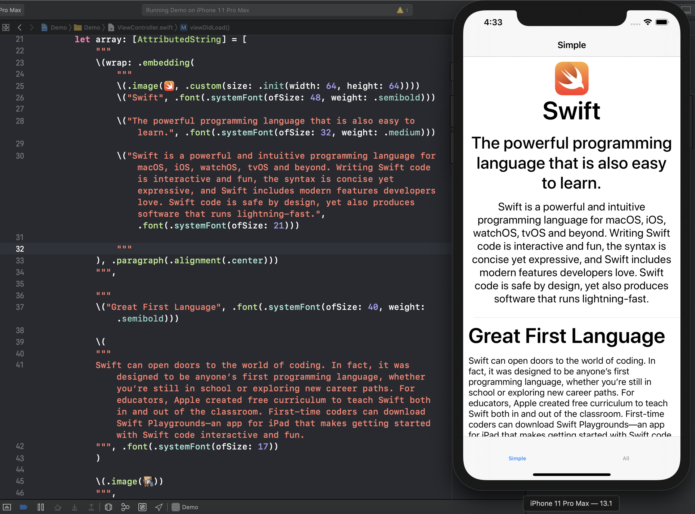
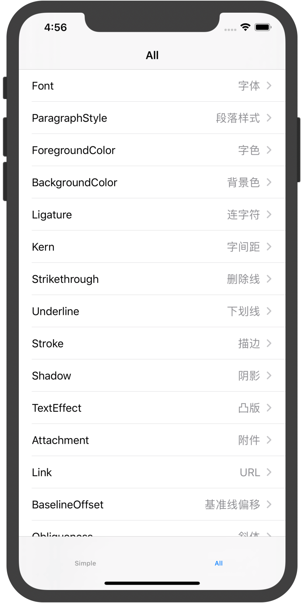
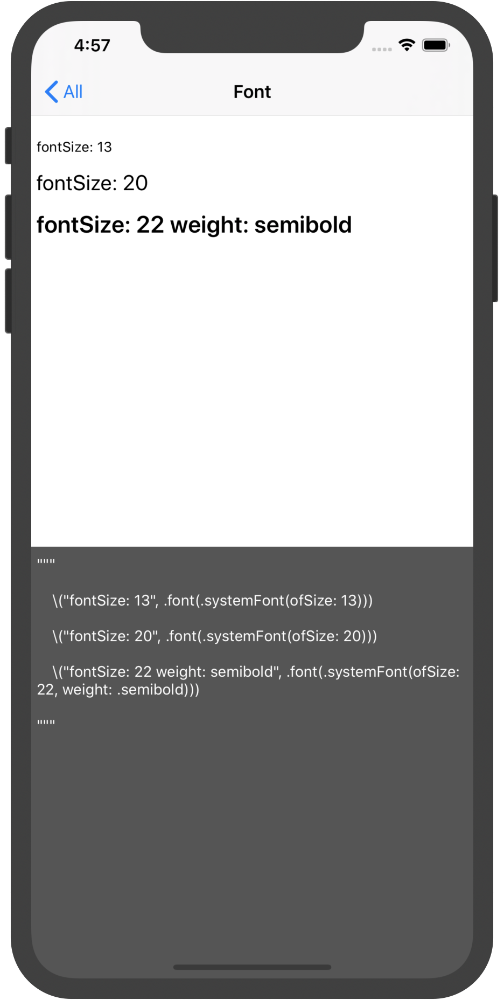
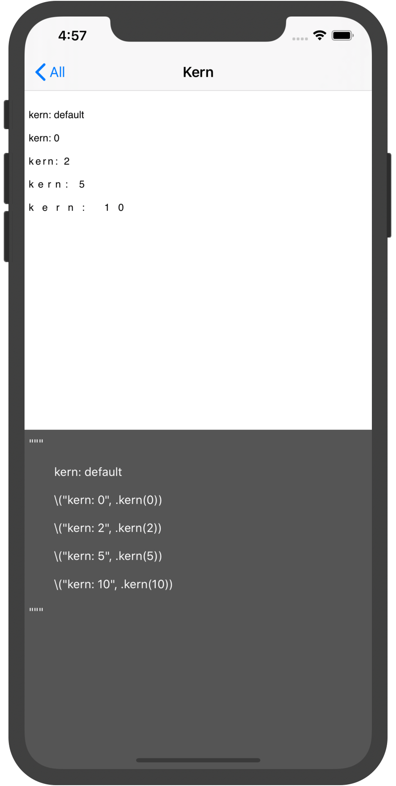
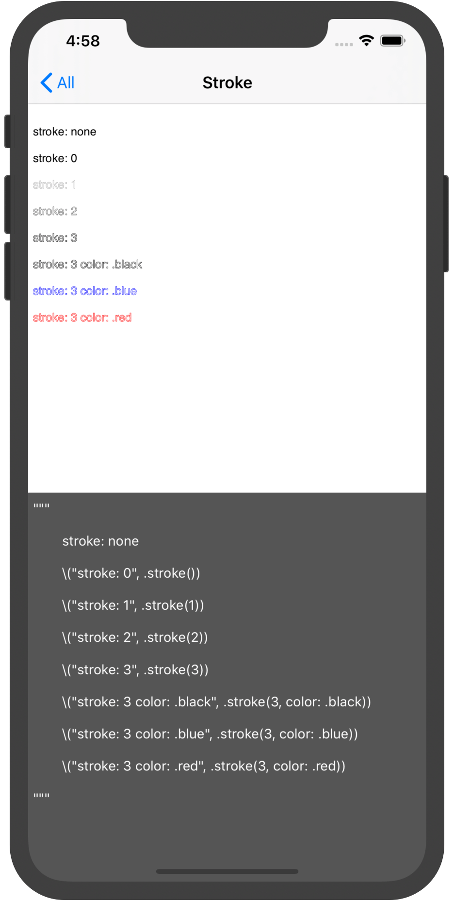

# AttributedString - 基于Swift插值方式优雅的构建富文本

[](LICENSE)&nbsp;
&nbsp;
&nbsp;
[](https://swift.org/package-manager/)&nbsp;
[](https://github.com/Carthage/Carthage)&nbsp;
[](https://cocoapods.org)

## [🇨🇳天朝子民](README_CN.md)

## Features

- [x] Constructing rich text using interpolation, Smooth coding, Elegant and natural style.
- [x] More control extension support.
- [x] Support for multi-level rich text cascading and provide other style priority strategies.
- [x] Support for all `NSAttributedString.Key` functions.
- [x] Support iOS & macOS & watchOS & tvOS.
- [x] Support text and attachment click or press event callback, support highlight style.
- [x] Support view attachment, you can add custom view to `UITextView`.
- [x] Continue to add more new features.

## Screenshot




<div align="center">


</div>


<div align="center">


</div>


## Installation

#### CocoaPods - Podfile

```ruby
pod 'AttributedString'
```

#### Carthage - Cartfile

```ruby
github "lixiang1994/AttributedString"
```

#### [Swift Package Manager for Apple platforms](https://developer.apple.com/documentation/xcode/adding_package_dependencies_to_your_app)

Select Xcode menu `File > Swift Packages > Add Package Dependency` and enter repository URL with GUI.  
```
Repository: https://github.com/lixiang1994/AttributedString
```

#### [Swift Package Manager](https://swift.org/package-manager/)

Add the following to the dependencies of your `Package.swift`:
```swift
.package(url: "https://github.com/lixiang1994/AttributedString.git", from: "version")
```


## Usage

First make sure to import the framework:

```swift
import AttributedString
```


How to initialize:

```swift
// Normal
let a: AttributedString = .init("lee", .font(.systemFont(ofSize: 13)))
// Interpolation
let b: AttributedString = "\("lee", .font(.systemFont(ofSize: 13)))"
```


Here are some usage examples. All devices are also available as simulators:


#### Font:

```swift
textView.attributed.text = """

\("fontSize: 13", .font(.systemFont(ofSize: 13)))

\("fontSize: 20", .font(.systemFont(ofSize: 20)))

\("fontSize: 22 weight: semibold", .font(.systemFont(ofSize: 22, weight: .semibold)))

"""
```

#### ForegroundColor:

```swift
textView.attributed.text = """

\("foregroundColor", .foreground(.white))

\("foregroundColor", .foreground(.red))

"""
```

#### Strikethrough: 

```swift
textView.attributed.text = """

\("strikethrough: single", .strikethrough(.single))

\("strikethrough: double color: .red", .strikethrough(.double, color: .red))

"""
```

#### Attachment: (Does not include watchOS)

```swift
// AttributedString.Attachment

textView.attributed.text = """

\(.data(xxxx, type: "zip"))

\(.file(try!.init(url: .init(fileURLWithPath: "xxxxx"), options: [])))

\(.attachment(NSTextAttachment()))

"""
```

#### Attachment Image: (Does not include watchOS)

```swift
// AttributedString.ImageAttachment

textView.attributed.text = """

\(.image(UIImage(named: "xxxx")))

\(.image(UIImage(named: "xxxx"), .custom(size: .init(width: 200, height: 200))))

\(.image(UIImage(named: "xxxx"), .proposed(.center))).

"""
```

#### Attachment View: (Only supports iOS: UITextView)

```swift
// AttributedString.ViewAttachment

textView.attributed.text = """

\(.view(xxxxView))

\(.view(xxxxView, .custom(size: .init(width: 200, height: 200))))

\(.view(xxxxView, .proposed(.center))).

"""
```

#### Wrap:

```swift
let a: AttributedString = .init("123", .background(.blue))
let b: AttributedString = .init("456", .background(.red))
textView.attributed.text = "\(wrap: a) \(wrap: b, .paragraph(.alignment(.center)))"

// Defalut embedding mode, Nested internal styles take precedence over external styles
textView.attributed.text = "\(wrap: a, .paragraph(.alignment(.center)))"
textView.attributed.text = "\(wrap: .embedding(a), .paragraph(.alignment(.center)))"
// Override mode, Nested outer style takes precedence over inner style
textView.attributed.text = "\(wrap: .override(a), .paragraph(.alignment(.center)))"
```

#### Append:

```swift
let a: AttributedString = .init("123", .background(.blue))
let b: AttributedString = .init("456", .background(.red))
let c: AttributedString = .init("789", .background(.gray))
textView.attributed.text = a + b
textView.attributed.text += c
```

#### Checking:

```swift
var string: AttributedString = .init("my phone number is +86 18611401994.", .background(.blue))
string.add(attributes: [.foreground(color)], checkings: [.phoneNumber])
textView.attributed.text = string
```

```swift
var string: AttributedString = .init("open https://www.apple.com and https://github.com/lixiang1994/AttributedString", .background(.blue))
string.add(attributes: [.foreground(color)], checkings: [.link])
textView.attributed.text = string
```

```swift
var string: AttributedString = .init("123456789", .background(.blue))
string.add(attributes: [.foreground(color)], checkings: [.regex("[0-6]")])
textView.attributed.text = string
```


#### Action: (Only supports iOS: UILabel / UITextView & macOS: NSTextField)

For complex styles, it is recommended to use UITextView.

UITextview needs to set `isEditable` and `isSelectable` to `false`.

##### Click:	

```swift
// Text
let a: AttributedString = .init("lee", .action({  }))
// Attachment (image)
let b: AttributedString = .init(.image(image), action: {
    // code
})

// It is recommended to use functions as parameters.
func clicked() {
    // code
}
// Normal
let c: AttributedString = .init("lee", .action(clicked))
let d: AttributedString = .init(.image(image), action: clicked)
// Interpolation
let e: AttributedString = "\("lee", .action(clicked))"
let f: AttributedString = "\(.image(image), action: clicked)"

// More information. 
func clicked(_ result: AttributedString.Action.Result) {
    switch result.content {
    case .string(let value):
       	print("Currently clicked text: \(value) range: \(result.range)")
				
    case .attachment(let value):
        print("Currently clicked attachment: \(value) range: \(result.range)")
    }
}

label.attributed.text = "This is \("Label", .font(.systemFont(ofSize: 20)), .action(clicked))"
textView.attributed.text = "This is a picture \(.image(image, .custom(size: .init(width: 100, height: 100))), action: clicked) Displayed in custom size."
```

##### Press:  

```swift
func pressed(_ result: AttributedString.Action.Result) {
    switch result.content {
    case .string(let value):
        print("Currently pressed text: \(value) range: \(result.range)")
                
    case .attachment(let value):
        print("Currently pressed attachment: \(value) range: \(result.range)")
    }
}

label.attributed.text = "This is \("Long Press", .font(.systemFont(ofSize: 20)), .action(.press, pressed))"
textView.attributed.text = "This is a picture \(.image(image, .custom(size: .init(width: 100, height: 100))), trigger: .press, action: pressed) Displayed in custom size."
```

##### Highlight style:    

```swift
func clicked(_ result: AttributedString.Action.Result) {
    switch result.content {
    case .string(let value):
        print("Currently clicked text: \(value) range: \(result.range)")
                
    case .attachment(let value):
        print("Currently clicked attachment: \(value) range: \(result.range)")
    }
}

label.attributed.text = "This is \("Label", .font(.systemFont(ofSize: 20)), .action([.foreground(.blue)], clicked))"
```

##### Custom: 

```swift
let custom = AttributedString.Action(.press, highlights: [.background(.blue), .foreground(.white)]) { (result) in
    switch result.content {
    case .string(let value):
        print("Currently pressed text: \(value) range: \(result.range)")
        
    case .attachment(let value):
        print("Currently pressed attachment: \(value) range: \(result.range)")
    }
}

label.attributed.text = "This is \("Custom", .font(.systemFont(ofSize: 20)), .action(custom))"
textView.attributed.text = "This is a picture \(.image(image, .original(.center)), action: custom) Displayed in original size."
```

#### Observe: (Only supports iOS: UILabel / UITextView & macOS: NSTextField)

```swift
label.attributed.observe([.phoneNumber], highlights: [.foreground(.blue)]) { (result) in
    print("Currently clicked \(result)")
}

textView.attributed.observe([.link], highlights: [.foreground(.blue)]) { (result) in
    print("Currently clicked \(result)")
}
```

For more examples, see the sample application.


## Properties available via `Attribute` class

The following properties are available:

| PROPERTY          | TYPE                                 | DESCRIPTION                                                  |
| ----------------- | ------------------------------------ | ------------------------------------------------------------ |
| font              | `UIFont`                             | font                                                         |
| color             | `UIColor`                            | foreground color                                             |
| background        | `UIColor`                            | background color                                             |
| paragraph         | `ParagraphStyle`                     | paragraph attributes                                         |
| ligature          | `Bool`                               | Ligatures cause specific character combinations to be rendered using a single custom glyph that corresponds to those characters |
| kern              | `CGFloat`                            | kerning                                                      |
| strikethrough     | `NSUnderlineStyle` . `UIColor`       | strikethrough style and color (if color is nil foreground is used) |
| underline         | `NSUnderlineStyle` , `UIColor`       | underline style and color (if color is nil foreground is used) |
| link              | `String` / `URL`                     | URL                                                          |
| baselineOffset    | `CGFloat`                            | character’s offset from the baseline, in point               |
| shadow            | `NSShadow`                           | shadow effect of the text                                    |
| stroke            | `CGFloat`, `UIColor`                 | stroke width and color                                       |
| textEffect        | `NSAttributedString.TextEffectStyle` | text effect                                                  |
| obliqueness       | `CGFloat`                            | text obliqueness                                             |
| expansion         | `CGFloat`                            | expansion / shrink                                           |
| writingDirection  | `WritingDirection` / `[Int]`         | initial writing direction used to determine the actual writing direction for text |
| verticalGlyphForm | `Bool`                               | vertical glyph (Currently on iOS, it's always horizontal.)   |


## Cases available via `Attribute.Checking` enumerated

| CASE                                 | DESCRIPTION                                         |
| ------------------------------------ | -------------------------------------------- |
| `range(NSRange)`                              | custom range                                                         |
| `regex(String)`                                    | regular expression                                                         |
| `action`                                                | action                                                                    |
| `date`                                                   | date (Based on `NSDataDetector`)                         |
| `link`                                                     | link (Based on `NSDataDetector`)                         |
| `address`                                             | address (Based on `NSDataDetector`)                         |
| `phoneNumber`                                  | phone number (Based on `NSDataDetector`)                         |
| `transitInformation`                            | transit Information (Based on `NSDataDetector`)                         |


## Contributing

If you have the need for a specific feature that you want implemented or if you experienced a bug, please open an issue.
If you extended the functionality of AttributedString yourself and want others to use it too, please submit a pull request.


## License

AttributedString is under MIT license. See the [LICENSE](LICENSE) file for more info.


-----

> ## 欢迎入群交流

